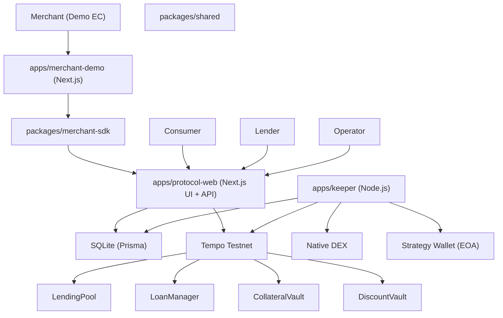

# 設計書

## アーキテクチャ概要

`docs/*`（PRD/機能設計/技術仕様/リポジトリ構造）に従い、**単一リポジトリに Web + API + Keeper + Contracts + DB** をまとめたモノレポとして実装する。

- monorepo: `pnpm` workspace（`apps/*`, `packages/*`）
- Web/API: Next.js（Protocol Web / Merchant Demo を別アプリ）
- DB: SQLite + Prisma
- Onchain: Solidity + Foundry（Tempo EVM）
- Chain接続: `viem`（EVM RPC）+ `viem/tempo`（Tempo Actions: DEX/Faucet 等）



## コンポーネント設計

### 1. Onchain（`contracts/`）

**責務**:
- BNPLローン台帳（open/repay/liquidate）
- Pool会計（shares、cash/receivablesの分離）
- 担保Vaultとdiscount利益Vaultの分離
- Strategy Pool（単一Strategy Wallet）の利益按分（`accProfitPerShare` / `rewardDebt`）
- 重要操作の権限（owner/operator/strategyWallet/invoiceSigner）

**実装の要点**:
- AlphaUSD/pathUSD は `decimals=6`。計算は `uint256` の最小単位（`10**6`）で扱う（浮動小数禁止）。
- EIP-712 署名検証:
  - Domain: `name=YieldDiscountBNPL`, `version=1`, `chainId=42431`, `verifyingContract=LoanManager`
  - message: `{ correlationId(bytes32), merchant(address), price(uint256), dueTimestamp(uint64) }`
  - `invoiceSigner` の署名のみを受理する（Checkout側で改ざんされてもrevert）。
- 会計方針（MVP）:
  - `LendingPool.totalAssets = cash + LoanManager.totalReceivables()`
  - `openLoan` で `cash -= merchantPayout`, `receivables += principal`（結果として `merchantFee` が純増）
  - `repay` で `receivables` を減らし `cash` を増やす（資産内の置換）
- Strategy Pool（単一Walletで資金が混ざる）:
  - `harvestProfit(profitAmount)` で **実現利益のみ**を DiscountVault に回収し、`accProfitPerShare` を更新
  - ローンの利用可能discountは `pendingProfit = strategyShares * accProfitPerShare / 1e18 - rewardDebt`
  - `repay` で `discountApplied` 分だけ `rewardDebt += discountApplied`（消費済みにする）
  - `returnStrategyPrincipal` は shares 減少に伴い `rewardDebt` を減らして `pendingProfit` の整合を保つ

**主要コントラクト**:
- `LendingPool`
  - `deposit/withdraw`（share方式）
  - `payMerchant(merchant, amount)`（LoanManager-only）
- `LoanManager`
  - `openLoan(invoice, signature, collateralDeposit)`
  - `repay(loanId, repayTargetAmount)`（延滞中はrevert、清算のみ）
  - `delegateInvestableToStrategy(loanId)`（only operator）
  - `harvestProfit(profitAmount)`（only operator）
  - `returnStrategyPrincipal(loanId, amount)`（only operator）
  - `liquidate(loanId)`（only operator）
- `CollateralVault`
  - 担保の保管、運用元本返却の受け皿、清算のseize、担保返却
- `DiscountVault`
  - `harvestProfit` で回収した利益を保持し、`repay` のdiscount原資として Pool へ支払う、余剰は Borrower へ返す

### 2. Protocol Web（`apps/protocol-web/`）

**責務**:
- Merchant API / Public API（請求作成/署名/照合/冪等性/ステータス）
- Checkout UI（`/checkout/[correlationId]`）: 請求表示、Privyログイン、`approve` + `openLoan`、`repay`
- 最小のLender操作（deposit/withdraw）と参照（必要ならUI、なければスクリプトでも可）
- 運用の可視化（UIまたはログ/Explorerで提示できる状態）

**実装の要点**:
- APIは Next.js Route Handlers（`src/app/api/**`）で実装する。
- Merchant認証: `Authorization: Bearer <apiKey>` を必須、DBにはハッシュのみ保存。
- `Idempotency-Key`:
  - `merchantId + key` を一意にし、`requestHash` が一致する場合は同一invoiceを返す
  - 不一致の場合は `409`
- 署名生成:
  - `INVOICE_SIGNER_PRIVATE_KEY` でEIP-712署名（`verifyingContract=LOAN_MANAGER_ADDRESS`）
  - `InvoiceData` は `price`/`dueTimestamp` を **bigint**（最小単位/秒）で持ち、JSON返却時は文字列化
- ステータス取得:
  - DB invoice + オンチェーン `LoanManager.getLoan(correlationId)` を合成し、オンチェーンを正として `created/loan_opened/paid` を判定する
- 金額の取り扱い:
  - 入力 `price` は `parseUnits(price, 6)` で最小単位へ（小数6桁超はreject、丸めない）
  - DBには文字列で保存（`"1000.00"` などの表示用、および最小単位文字列のどちらかを統一）

### 3. Merchant SDK（`packages/merchant-sdk/`）

**責務**:
- Merchant API を数行で呼べるthin wrapper
- typed responses（invoice作成/ステータス取得）

**実装の要点**:
- server-only（APIキーを扱うため）: `import "server-only";`
- `PROTOCOL_API_BASE_URL` と `DEMO_MERCHANT_API_KEY` を受け取り、`fetch` ラッパを提供する

### 4. Merchant Demo（`apps/merchant-demo/`）

**責務**:
- 購入ボタン →（server route handler / server action）→ SDKで請求作成 → Checkoutへリダイレクト

**実装の要点**:
- ブラウザにAPIキーを露出しない（SDKはサーバー側のみで実行）
- `checkoutUrl` を受け取り `redirect()` するだけの単純な実装にする

### 5. Keeper（`apps/keeper/`）

**責務**:
- `Actions.dex.placeFlipSync` によるflip order（`AlphaUSD/pathUSD`）運用（ベストエフォート）
- `delegateInvestableToStrategy/harvestProfit/returnStrategyPrincipal/liquidate` の実行（operator権限）
- `orderId`、txHash、簡易状態（ロック/最終実行時刻）をログ or DBで追跡

**実装の要点**:
- MVPは「常駐ポーリング」または「手動コマンド」どちらでも成立する設計にする
  - 例: `pnpm -C apps/keeper start`（poll loop）
  - 例: `pnpm -C apps/keeper run place-flip` / `unwind` / `harvest` / `return-principal`（手動）
- 二重実行防止: SQLiteに `keeper_lock`（`locked_until`）等を設ける（常駐の場合）

## データフロー

### E2Eデモ（最小）

1. Merchant Demo（サーバー）→ Merchant API: `POST /api/merchant/invoices`（Idempotency-Keyあり）
2. Merchant API:
   - APIキー認証
   - `invoiceId(UUID)` と `correlationId(random bytes32)` 生成
   - `InvoiceData` をEIP-712で署名し、DBへ保存
   - `checkoutUrl = {NEXT_PUBLIC_APP_URL}/checkout/{correlationId}`
3. Consumer → Checkout:
   - Public APIで `invoiceData + signature` を取得
   - Privyログイン
   - AlphaUSD `approve(LoanManager)` → `openLoan(...)`
4. Operator/Keeper:
   - `delegateInvestableToStrategy`（`investableCollateral >= MIN_DEX_ORDER` の場合）
   - DEXでflip order運用 → unwind → `harvestProfit(profitAmount)` → `returnStrategyPrincipal`
5. Consumer:
   - `repay(loanId, repayTargetAmount)`（discount適用）
   - 完済時: 担保返却 + 余剰profitの返却

## エラーハンドリング戦略

### TypeScript（API）

- `ApiError`（`status`, `code`, `message`）で「想定エラー」を統一する
- 返却ステータスは `docs/development-guidelines.md` に合わせて最小限に揃える
  - `400`（バリデーション）, `401`（認証）, `409`（冪等性衝突）, `500`（想定外）

### Solidity（Contracts）

- `error`（custom errors）を使って revert reason を短くする
- 例:
  - `InvalidSignature()`
  - `InsufficientCollateral()`
  - `PoolInsufficientCash()`
  - `RepayTooLate()`
  - `RepayExceedsOutstanding()`
  - `NotOperator()`

## テスト戦略

### ユニットテスト（Foundry）

`docs/functional-design.md` のテスト戦略に従う:

- `openLoan`: 署名検証、担保計算、`merchantFee/merchantPayout`、Pool会計、イベント
- `repay`: pendingProfit、discount適用、充当順序（fees->principal）、完済クローズ（`strategyPrincipalOutstanding==0` 要求）
- `delegateInvestableToStrategy`: `MIN_DEX_ORDER`、shares/rewardDebt、strategyWallet送金
- `harvestProfit`: DiscountVault入金、`accProfitPerShare` 更新
- `returnStrategyPrincipal`: shares burn、rewardDebt調整、CollateralVault返却
- `liquidate`: due+grace後のみ、penalty一括計算、回収/返却
- Pool `deposit/withdraw`: share計算、cash不足revert

### 統合テスト（API）

- invoice作成（idempotency含む）→ Public API取得 → onchain `openLoan` → Merchantステータスが `created -> loan_opened` に遷移すること

### E2E（手動デモ）

- PRDデモスクリプト（`price=1000`, `collateralDeposit=1600`）を固定手順として実施

## 依存ライブラリ

MVPで追加する想定（確定は実装時に `package.json` に反映）:

```json
{
  "dependencies": {
    "next": "^15",
    "react": "^19",
    "tailwindcss": "^3",
	    "@privy-io/react-auth": "latest",
	    "viem": "^2",
	    "@prisma/client": "latest",
	    "zod": "^3"
	  },
  "devDependencies": {
    "prisma": "latest",
    "typescript": "^5",
    "eslint": "latest",
    "prettier": "latest"
  }
}
```

## ディレクトリ構造

`docs/repository-structure.md` に従い、最低限以下を作成する:

```text
.steering/20260214-initial-implementation/
apps/
  protocol-web/
  merchant-demo/
  keeper/
packages/
  merchant-sdk/
  shared/
contracts/
prisma/
scripts/
ops/ (必要になった時点で)
```

## 実装の順序

1. monorepo scaffolding（pnpm workspace、tsconfig、lint/typecheck/build scripts、`.env.example`、README）
2. Prisma schema + migrate + seed（Merchant/APIキー、Invoice、Idempotency）
3. Contracts（Pool/Loan/Vaults）+ Foundry tests
4. `packages/shared`（chain定数、typed data、ABI格納）+ `sync:abis` スクリプト
5. Protocol Web: Merchant API / Public API（署名、idempotency、ステータス）
6. Protocol Web: Checkout UI（Privy、approve/openLoan、repay）
7. Merchant SDK + Merchant Demo（請求作成→Checkout遷移）
8. Keeper（最小。手動コマンド優先、必要ならポーリング化）
9. E2Eデモ手順の固定（README更新、ログ出力整備）

## セキュリティ考慮事項

- 秘密鍵/APIキーは環境変数で注入し、ブラウザへ露出させない
- `packages/merchant-sdk` は server-only を強制
- `openLoan` はEIP-712署名検証で改ざんをrevert
- operator操作は onchain `onlyOperator` で制限する（MVPは運営EOAのみ）

## パフォーマンス考慮事項

- MVPはスループット最適化より「デモ成功/再現性」を優先する
- status取得はオンチェーン参照を正としつつ、必要ならDBにキャッシュを持つ（後回し）

## 将来の拡張性

- Strategy Poolを高度化（複数ペア/複数Wallet/リスク制御/自動清算）
- DBを Postgres/Turso へ移行（複数インスタンス/高可用）
- Merchant連携を webhook/署名付きイベントで拡張
