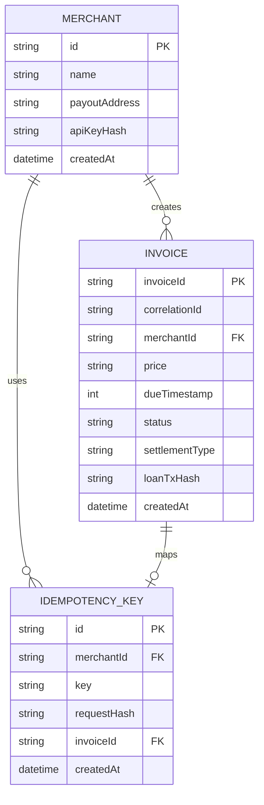
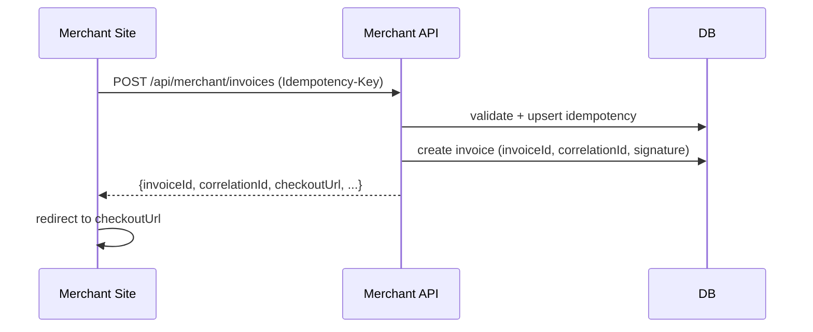
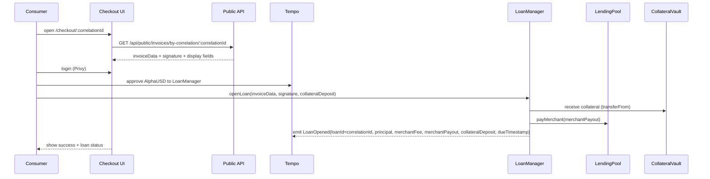
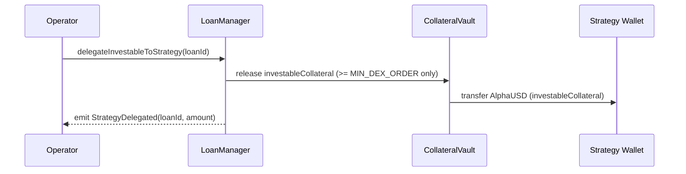
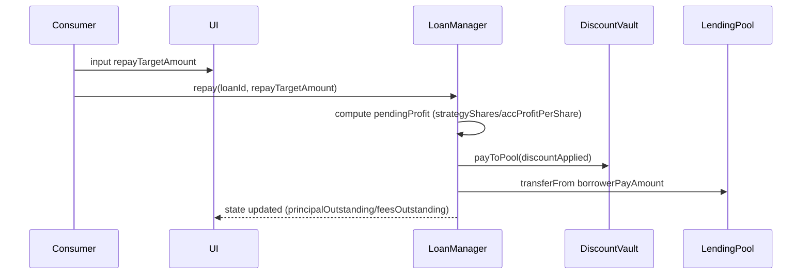
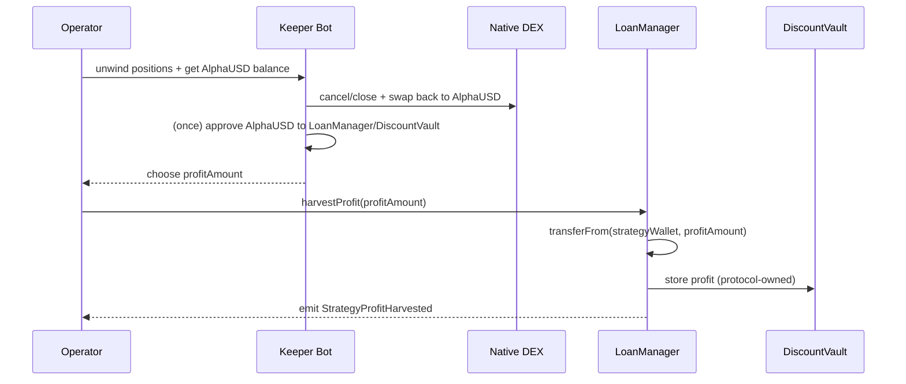
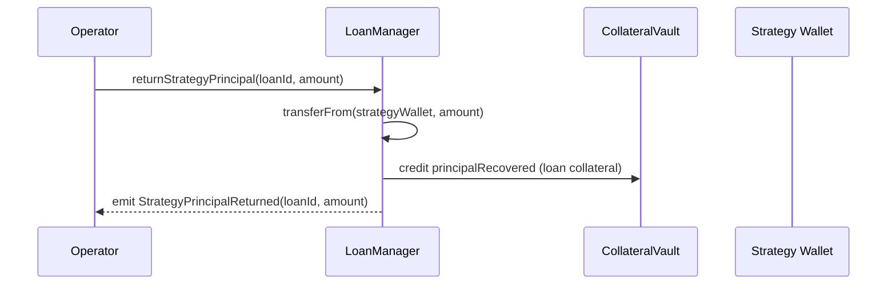
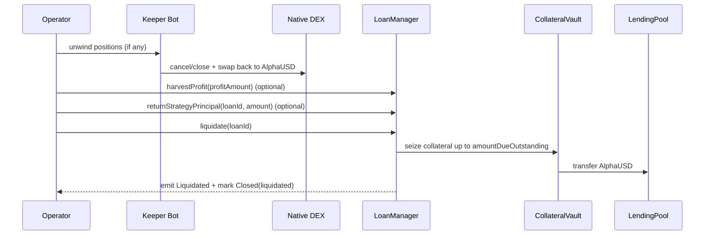
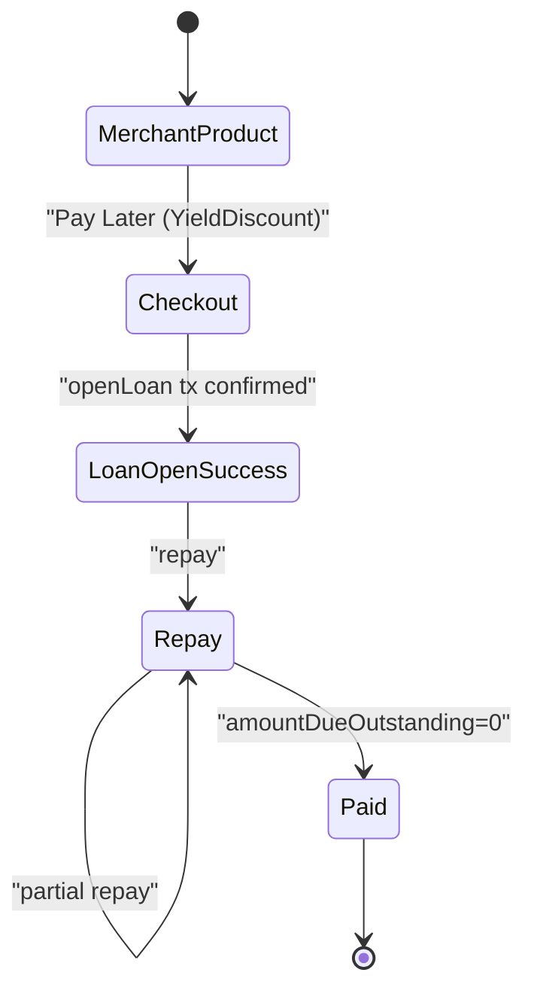

# 機能設計書 (Functional Design Document)

## 対象スコープ（ハッカソンMVP / P0）

- Merchant: SDK/APIで請求作成、Checkout遷移、請求ステータス取得（`invoiceId` / `correlationId`）
- Consumer: Privyログイン、担保Deposit + BNPL開始、ローン表示、部分返済、完済/清算後の担保返却
- Lender: Lending Poolへ預け入れ/引き出し（share方式）
- Operator: DEX運用の開始/停止、`harvestProfit`（実現利益回収）、運用元本の返却、清算（Operator-only）
- Protocol（オンチェーン）: Pool、Loan台帳、担保Vault、Discount Vault、discount適用
- Yield（オフチェーン）: TempoネイティブDEXの `placeFlipSync` によるflip order運用

## システム構成図

```mermaid
graph TB
  %% Actors
  Merchant[Merchant (Demo EC)]
  Consumer[Consumer]
  Lender[Lender]
  Operator[Operator]

  %% Offchain
  ProtocolWeb[Protocol Web (Next.js: Checkout + Consumer + Dashboards + API)]
  MerchantDemoWeb[Merchant Demo Web (Next.js: Demo EC)]
  API[Merchant API / Public API (in Protocol Web)]
  DB[(DB: SQLite)]
  Keeper[Keeper Bot (DEX MM)]
  Strat[Strategy Wallet (Operator EOA)]

  %% Onchain / Tempo
  Tempo[Tempo Testnet]
  Tip20[TIP-20 AlphaUSD/pathUSD]
  Dex[Native DEX]
  Pool[LendingPool (shares)]
  LoanMgr[LoanManager]
  ColVault[CollateralVault]
  DiscVault[DiscountVault]

  Merchant --> MerchantDemoWeb
  Consumer --> ProtocolWeb
  Lender --> ProtocolWeb
  Operator --> ProtocolWeb

  MerchantDemoWeb --> API
  ProtocolWeb --> API
  API --> DB
  ProtocolWeb --> Tempo
  Keeper --> Tempo
  Keeper --> Strat

  Tempo --> Tip20
  Tempo --> Dex
  Tempo --> Pool
  Tempo --> LoanMgr
  Tempo --> ColVault
  Tempo --> DiscVault

  LoanMgr --> Pool
  LoanMgr --> ColVault
  LoanMgr --> DiscVault
  LoanMgr --> Strat
  Keeper --> Dex
```

## 技術スタック（実装想定）

| 分類 | 技術 | 選定理由 |
| --- | --- | --- |
| フロントエンド | Next.js + React + Tailwind CSS | 1リポジトリでProtocol WebとMerchant Demoを別アプリとして持ち、同一スタックで速度優先 |
| 認証/ウォレット | Privy | Web3非専門ユーザーのオンボーディングを最短化 |
| チェーン接続 | `viem` + `tempo.ts` | TempoのTIP-20/DEX Actionsを扱いやすい |
| バックエンド | Next.js Route Handlers | Protocol WebにMerchant API/Public APIを同居させて実装量を削減 |
| DB | SQLite（Prisma） | デモ要件の永続化（invoice/merchant/idempotency）に十分 |
| コントラクト | Solidity + Foundry | Tempo EVM上で実装しやすい |
| Keeper | Node.js（`tempo.ts/viem`） | flip order運用をスクリプト/cronで実装可能 |

## ドメイン分割（責務）

- Offchain
  - Merchant API: invoice作成/照合ID発行/Checkout URL発行/ステータス取得
  - Checkout UI: Consumerのログイン、コントラクト呼び出し、状態表示
  - Keeper Bot: DEX運用（flip order）、運用停止、`Strategy Wallet` を操作して注文を実行（MVPは単一Wallet）
  - Operator Dashboard: keeper操作、NAV/PnL/discountCreditsの確認
  - Strategy Wallet（EOA、単一）: DEX運用資金の実行アカウント（ハッカソンMVPは運営管理）
- Onchain（EVM）
  - LendingPool: Lenderの入出金とshares、Merchantへの支払い原資の管理
  - LoanManager: BNPL（ローン開始/返済/延滞/清算）と会計（receivables集計）
  - CollateralVault: Borrower担保の保管、担保返却/清算時の支払い
  - DiscountVault: Borrowerの `discountCredits`（利益）の保管と支出（Pool支払い/返却）

## データモデル定義

### Offchain（DB）

```ts
export type InvoiceStatus = "created" | "loan_opened" | "paid";
export type SettlementType = "repaid" | "liquidated";

export interface Merchant {
  id: string; // UUID
  name: string;
  payoutAddress: `0x${string}`; // Tempo EVM address
  apiKeyHash: string; // APIキーのハッシュ
  createdAt: Date;
  updatedAt: Date;
}

export interface Invoice {
  invoiceId: string; // UUID
  correlationId: `0x${string}`; // bytes32 hex
  merchantId: string; // FK
  price: string; // AlphaUSD, decimals=6 (文字列で保持)
  dueTimestamp: number; // unix seconds

  merchantFee: string; // price*3%
  merchantPayout: string; // price-merchantFee

  status: InvoiceStatus;
  settlementType?: SettlementType; // status=paid のときのみ

  // Onchain references
  loanTxHash?: `0x${string}`;
  merchantPayoutTxHash?: `0x${string}`;

  // Signature for onchain verification (EIP-712)
  invoiceDataJson: string;
  invoiceSignature: `0x${string}`;

  createdAt: Date;
  updatedAt: Date;
}

export interface IdempotencyKey {
  id: string; // UUID
  merchantId: string; // FK
  key: string; // header value
  requestHash: string; // body hash
  invoiceId: string; // FK
  createdAt: Date;
}
```

**制約（MVP）**:
- `correlationId` は `randomBytes32()` で生成し、`invoiceId` と1:1で紐づく
- 同一 `merchantId + Idempotency-Key` は同一 `requestHash` のみ許容（違う場合 `409`）

### Onchain（Solidity）

```solidity
enum LoanState {
  None,
  Open,
  Closed
}

enum SettlementType {
  None,
  Repaid,
  Liquidated
}

struct Loan {
  bytes32 id; // correlationId (= loanId)
  address borrower;
  address merchant;

  uint256 principal; // price, decimals=6
  uint256 merchantFee; // principal*3%
  uint256 merchantPayout; // principal-merchantFee
  uint256 principalOutstanding;
  uint256 feesOutstanding; // MVPではopen中は0（liquidate時に一括計算して回収する）

  uint256 collateralDeposit;
  uint256 reservedCollateral;
  uint256 investableCollateral;
  uint256 strategyPrincipalOutstanding; // Strategy Walletへ委任中の元本（loan単位）

  // Strategy Pool accounting (realized profit only; MasterChef style)
  uint256 strategyShares; // 参加shares（MVP: 1 share = 1 AlphaUSD delegated）
  uint256 rewardDebt; // 既に消費/返却済みの利益（accProfitPerShare基準）

  uint64 dueTimestamp;
  uint64 openedAt;

  bool lateFeeCharged;
  LoanState state;
  SettlementType settlementType; // state=Closed のときのみ
}
```

**主要イベント（MVP）**:
- `LoanOpened(bytes32 loanId, address borrower, address merchant, uint256 principal, uint256 merchantFee, uint256 merchantPayout, uint256 collateralDeposit, uint64 dueTimestamp)`
- `StrategyDelegated(bytes32 loanId, uint256 amount)`
- `Repaid(bytes32 loanId, address payer, uint256 repayTargetAmount, uint256 discountApplied, uint256 borrowerPayAmount)`
- `StrategyProfitHarvested(uint256 profit, uint256 accProfitPerShare)`
- `StrategyPrincipalReturned(bytes32 loanId, uint256 amount)`
- `Liquidated(bytes32 loanId, uint256 amountRecoveredToPool)`
- `CollateralReturned(bytes32 loanId, address borrower, uint256 amount)`
- `DiscountRefunded(bytes32 loanId, address borrower, uint256 amount)`

### ER図（Offchain）



## コンポーネント設計

### Merchant API（invoice作成/照合/署名）

**責務**:
- Merchant APIキー認証
- `correlationId` 生成（ランダムbytes32）
- invoiceの永続化（DB）
- Checkout URLの発行
- onchain検証用のinvoiceデータ署名（EIP-712）
- ステータス取得（DBは照合、Loan状態はオンチェーンを正として都度参照）

**インターフェース（概念）**:

```ts
class MerchantService {
  createInvoice(input: {
    merchantId: string;
    price: string;
    dueTimestamp: number;
    description?: string;
    idempotencyKey: string;
  }): Promise<{
    invoiceId: string;
    correlationId: `0x${string}`;
    checkoutUrl: string;
    merchantFee: string;
    merchantPayout: string;
    dueTimestamp: number;
  }>;

  getInvoiceByInvoiceId(merchantId: string, invoiceId: string): Promise<Invoice>;
  getInvoiceByCorrelationId(merchantId: string, correlationId: `0x${string}`): Promise<Invoice>;
}
```

**署名方式（MVP）**:
- Merchant APIが以下をEIP-712で署名して返す
- コントラクトは `invoiceSigner`（運営の署名鍵）を検証する

```ts
type InvoiceTypedData = {
  correlationId: `0x${string}`;
  merchant: `0x${string}`;
  price: bigint;
  dueTimestamp: bigint;
};
```

**EIP-712 Domain（MVP固定）**:
- `name`: `YieldDiscountBNPL`
- `version`: `1`
- `chainId`: `42431`（Tempo Testnet / Moderato）
- `verifyingContract`: `LoanManager` のコントラクトアドレス

この署名により、Checkoutが受け取ったinvoiceデータ（merchant/price/dueTimestamp）が改ざんされても `openLoan` がrevertする。

### Checkout UI（Consumer）

**責務**:
- `correlationId` から請求情報を取得して表示
- Privyログイン
- AlphaUSDのApproveと `openLoan` 呼び出し
- ローン/discount/返済UI（部分返済）

**主要画面**:
- `/checkout/:correlationId`（Checkout）
- `/consumer/loans/:correlationId`（ローン詳細。Checkoutと同一でも可）

### Keeper Bot（DEX運用）

**責務**:
- `Actions.dex.placeFlipSync` によるflip order発注
- 板/注文状態の取得（`getOrderbook`, `getOrder(s)`）
- （デモ用）運用停止/回収の補助

**実装前提（MVP簡略）**:
- 取引ペア固定: `AlphaUSD/pathUSD`
- パラメータ固定: `tick=1.001`、`flipTick=0.999`
  - 注文額: Strategy Walletが運用に回すAlphaUSD（例: `totalDelegated - buffer`、ただし `>= MIN_DEX_ORDER`）
- 失敗時は「運用なし（discount=0）」で続行（詳細なリトライ/復旧は設計しない）
- 単一Strategy Walletに複数ローンの運用資金を集約して運用する（Strategy Pool）
  - ローンごとのdiscount原資（実現利益）は、Strategy Poolのsharesで按分して算出する

### Onchain Contracts

#### LendingPool

**責務**:
- Lenderの `deposit/withdraw`（share方式）
- Pool cash（AlphaUSD）を保持
- Loan開始時の `merchantPayout` 支払い

#### LoanManager

**責務**:
- `openLoan`（署名検証、担保受領、PoolからMerchantへ支払い、台帳更新）
- `repay`（部分返済、discount適用、receivables更新）
- `delegateInvestableToStrategy`（運用資金の委任。CollateralVault -> Strategy Wallet）
- `harvestProfit`（Strategy Walletから実現利益のみを回収し、Strategy Poolの利益分配を更新）
- `returnStrategyPrincipal`（運用元本をStrategy WalletからCollateralVaultへ戻す。完済/清算前に必要）
- `liquidate`（延滞清算、Pool回収、クローズ）
- `totalReceivables` の集計値を保持（Poolの `totalAssets` 計算用）

**MVPの簡略ルール（単一Strategy Wallet / Strategy Pool）**:
- `strategyWallet` は単一の運営EOAで固定（ownerが設定）
- 複数ローンの `investableCollateral` を同一Walletに集約して運用する（資金は混ざる）
- 混ざった資金から生まれた実現利益は、ローンごとの `strategyShares` に対して按分してdiscountとして利用する（MasterChef方式: `accProfitPerShare` / `rewardDebt`）

#### CollateralVault

**責務**:
- ローン単位で担保を保管し、清算/返却を行う
- `reservedCollateral` を常に残すため、運用への払い出しは `investableCollateral` の範囲に限定

#### DiscountVault

**責務**:
- keeper/operator が回収した「実現利益（AlphaUSD）」を保管（Pool資産と分離）
- `repay` 時にPoolへ送金してdiscountとして消費（LoanManagerが金額を計算）
- ローン終了時に未使用の利益（`pendingProfit`）があればBorrowerへ返却

## ユースケース（シーケンス）

### 1) Merchant: 請求作成 -> Checkout URL発行



### 2) Consumer: CheckoutでBNPL開始（担保Deposit + Merchantへ即時支払い）



### 2.1) Operator: 運用資金の委任（CollateralVault -> Strategy Wallet）



### 3) Consumer: 部分返済（discount適用）



### 4) Operator: `harvestProfit`（実現利益の回収と分配更新）



### 4.1) Operator: `returnStrategyPrincipal`（運用元本の返却）



### 5) Operator: 清算（延滞）



## 画面遷移（MVP）



## UIワイヤー（簡易）

### Merchantデモ商品ページ（例）

```text
+--------------------------------------------------+
| Product: Tempo Hoodie (AlphaUSD 1000)            |
| [ Pay Later (YieldDiscount) ]                    |
|  - BNPL: 14 days, 0% within due                  |
|  - Deposit collateral required                   |
+--------------------------------------------------+
```

### Checkout（/checkout/[correlationId]）

```text
+--------------------------------------------------+
| YieldDiscount Checkout                            |
| Merchant: {name}   Price: {price}                |
| Due: {dueDate}                                     |
| Collateral ratio: 125%  Max invest: 50%           |
| Required reserved: {reservedCollateral}           |
| Investable max: {investableCollateral}            |
|                                                   |
| [ Login (Privy) ]                                 |
| [ Approve AlphaUSD ] [ Deposit & Pay Later ]      |
|                                                   |
| Loan status: created/loan_opened/paid             |
+--------------------------------------------------+
```

### Operator Dashboard（/operator）

```text
+--------------------------------------------------+
| Operator Dashboard                                |
| LoanId: {correlationId}  HF: {healthFactor}       |
| Strategy: bestBid/bestAsk, orderId, NAV, PnL       |
| DiscountCredits: {discountCredits}                 |
| [ Start ] [ Stop ] [ HarvestProfit ] [ ReturnPrincipal ] [ Liquidate ] |
+--------------------------------------------------+
```

## API設計

### Merchant API（認証必須）

#### POST /api/merchant/invoices

**Headers**:
- `Authorization: Bearer <apiKey>`
- `Idempotency-Key: <string>`

**Request**:
```json
{
  "price": "1000.00",
  "dueTimestamp": 1700000000,
  "description": "Tempo Hoodie"
}
```

**Response**:
```json
{
  "invoiceId": "uuid",
  "correlationId": "0x...",
  "checkoutUrl": "https://.../checkout/0x...",
  "price": "1000.00",
  "principal": "1000.00",
  "merchantFee": "30.00",
  "merchantPayout": "970.00",
  "dueTimestamp": 1700000000
}
```

**Error**:
- 400: price/dueTimestampが不正
- 401: APIキー不正
- 409: 同一Idempotency-KeyでrequestHashが異なる

#### GET /api/merchant/invoices/:invoiceId

**Response（例）**:
```json
{
  "invoiceId": "uuid",
  "correlationId": "0x...",
  "status": "loan_opened",
  "settlementType": null,
  "amountDueOutstanding": "1000.00",
  "principalOutstanding": "1000.00",
  "feesOutstanding": "0.00",
  "dueTimestamp": 1700000000,
  "merchantPayoutTxHash": "0x..."
}
```

注: `merchantPayoutTxHash` は `openLoan` のトランザクションハッシュ（同一tx内でPool->Merchant送金が発生するため、別txのhashは存在しない）。

#### GET /api/merchant/invoices/by-correlation/:correlationId

**Response**: 上記と同様

### Public API（Checkout用。認証なし）

#### GET /api/public/invoices/by-correlation/:correlationId

**Response（例）**:
```json
{
  "correlationId": "0x...",
  "merchant": {
    "name": "Demo Store",
    "payoutAddress": "0x..."
  },
  "price": "1000.00",
  "dueTimestamp": 1700000000,
  "invoiceData": {
    "correlationId": "0x...",
    "merchant": "0x...",
    "price": "1000000000",
    "dueTimestamp": "1700000000"
  },
  "invoiceSignature": "0x..."
}
```

### 照合（Reconciliation, MVP）

- Merchant側の照合キーは `invoiceId`（オフチェーン）と `correlationId(=loanId, bytes32)`（オンチェーン）
- `invoiceId -> correlationId` は Merchant API のレスポンスで取得し、Merchant側DBに保存する
- オンチェーン側では `LoanOpened(loanId=correlationId, merchant, principal, merchantFee, merchantPayout, collateralDeposit, dueTimestamp)` を正とし、支払い成立/照合を行う
- TIP-20のmemoは、コントラクト内からの送金では扱いが複雑になるため、MVPでは使用しない（イベント + txHashで追跡）

## コントラクト設計（MVPのI/F）

### LendingPool（概略）

```solidity
function deposit(uint256 assets) external returns (uint256 shares);
function withdraw(uint256 shares) external returns (uint256 assets);

function cash() external view returns (uint256);
function totalShares() external view returns (uint256);
function totalAssets() external view returns (uint256); // cash + totalReceivables (from LoanManager)

function payMerchant(address merchant, uint256 amount) external; // only LoanManager
```

**shares計算（MVP）**:
- `totalAssets = cash + loanManager.totalReceivables()`
- `deposit(assets)`:
  - 初回: `shares = assets`
  - それ以外: `shares = assets * totalShares / totalAssets`（floor）
- `withdraw(shares)`:
  - `assets = shares * totalAssets / totalShares`（floor）
  - `cash < assets` の場合はrevert（流動性不足）

### LoanManager（概略）

```solidity
struct InvoiceData {
  bytes32 correlationId;
  address merchant;
  uint256 price; // AlphaUSD, decimals=6
  uint64 dueTimestamp;
}

function openLoan(
  InvoiceData calldata invoice,
  bytes calldata signature,
  uint256 collateralDeposit
) external;

function repay(bytes32 loanId, uint256 repayTargetAmount) external;
function delegateInvestableToStrategy(bytes32 loanId) external; // only operator
function harvestProfit(uint256 profitAmount) external; // only operator
function returnStrategyPrincipal(bytes32 loanId, uint256 amount) external; // only operator
function liquidate(bytes32 loanId) external; // only operator

function getLoan(bytes32 loanId) external view returns (Loan memory);
function amountDueOutstanding(bytes32 loanId) external view returns (uint256);
function totalReceivables() external view returns (uint256);
function strategyWallet() external view returns (address);
function strategyTotalShares() external view returns (uint256);
function accProfitPerShare() external view returns (uint256);
function pendingProfit(bytes32 loanId) external view returns (uint256);
```

### CollateralVault / DiscountVault（概略）

```solidity
function collateralOf(bytes32 loanId) external view returns (uint256);

// LoanManager-only (概念)
function releaseInvestableToStrategy(bytes32 loanId, address to, uint256 amount) external;
function creditPrincipalRecovered(bytes32 loanId, uint256 amount) external;
function seizeToPool(bytes32 loanId, address pool, uint256 amount) external;
function returnCollateral(bytes32 loanId, address borrower) external;

// DiscountVault: holds harvested profit (protocol-owned)
function payToPool(address pool, uint256 amount) external;
function refundToBorrower(address borrower, uint256 amount) external;
```

## アルゴリズム設計（計算ロジック）

### 定数（MVP固定）

- `MERCHANT_FEE_BPS = 300`（3.0%）
- `COLLATERAL_RATIO_BPS = 12_500`（125%）
- `MAX_INVEST_BPS = 5_000`（50%）
- `MIN_DEX_ORDER = 100 * 10**6`（AlphaUSD換算 $100、decimals=6）
- `ACC_PRECISION = 1e18`（Strategy Poolの利益按分用）
- `GRACE_PERIOD = 3 days`
- `LATE_FEE = 5 * 10**6`（AlphaUSD換算 $5、decimals=6）
- `PENALTY_BPS_PER_DAY = 10`（0.10%/day）
- `PENALTY_CAP_BPS = 1_000`（10%、late fee含む）

### 1) 担保計算

- `reservedCollateral = principal * 125%`
- `investableCollateral = min(collateralDeposit - reservedCollateral, collateralDeposit * 50%)`（0未満なら0）
- `delegateInvestableToStrategy` は `investableCollateral >= MIN_DEX_ORDER` の場合のみ実行する（満たさない場合は運用なし、discount=0）
  - 成功時: Strategy Walletへ送金し、`strategyPrincipalOutstanding/strategyShares` を増やし、`rewardDebt` を更新する

### 2) discount適用（部分返済）

- MVPでは「延滞中の任意返済」はデモ対象外のため、`block.timestamp > dueTimestamp + GRACE_PERIOD` の場合は `repay` をrevertし、`liquidate` のみでクローズする
- Strategy Poolの実現利益は `accProfitPerShare` により按分され、ローンごとの `discountCredits`（=利用可能discount原資）は以下で算出する（下限0）
  - `pendingProfit = strategyShares * accProfitPerShare / ACC_PRECISION - rewardDebt`
  - `discountCredits = pendingProfit`（MVPでは同義。別途のcredit残高は持たない）
- `discountApplied = min(discountCredits, repayTargetAmount)`
- `borrowerPayAmount = repayTargetAmount - discountApplied`
- 充当順序: `feesOutstanding -> principalOutstanding`
- `discountApplied > 0` の場合:
  - `rewardDebt += discountApplied`（使った分だけ利益を消費済みにする）
  - DiscountVaultからPoolへ `discountApplied` を送金する
- `amountDueOutstanding == 0` になった場合:
  - `strategyPrincipalOutstanding == 0` を要求（運用元本が戻っていない場合はcloseできない。MVP簡略）
  - `state=Closed`、`settlementType=Repaid`
  - CollateralVaultから担保をBorrowerへ返却
  - 返却時点で `pendingProfit` が残っていればBorrowerへ返却する（DiscountVault -> Borrower）

### 3) 遅延ペナルティ（MVP）

- MVPでは、延滞のlate fee/penaltyは **`liquidate()` 実行時に一括計算**して回収額に加える（オンチェーンに日次でaccrueしない）
- `lateStart = dueTimestamp + gracePeriod`
  - `block.timestamp <= lateStart` の場合: `feesToCharge = 0`
- `block.timestamp > lateStart` の場合:
  - `daysLate = floor((block.timestamp - lateStart) / 1 days) + 1`
  - `lateFeeCandidate = 5 USD`
  - `penaltyCandidate = principalOutstanding * 0.10%/day * daysLate`（simple）
  - `feesToCharge = min(lateFeeCandidate + penaltyCandidate, principal * 10%)`（cap、late fee含む）
- ハッカソンMVPでは「延滞中の部分返済」フローはデモ対象外とし、penaltyは清算時の回収に寄せる

### 4) `harvestProfit`（実現利益の回収と分配更新）

- `profitAmount`: operatorが `harvestProfit` に指定する回収利益額（AlphaUSD、実現利益のみ）
  - 前提: keeperがDEX注文を解消し、Strategy Walletの残高（AlphaUSD）を確認できる
- `harvestProfit(profitAmount)` は以下を行う
  - `transferFrom(strategyWallet, profitAmount)` で DiscountVaultへ入金（Pool資産と混ぜない）
  - `accProfitPerShare += profitAmount * ACC_PRECISION / strategyTotalShares`
  - これにより、各ローンの `pendingProfit` が増える（ローン単位のonchainループは不要）

### 4.1) `returnStrategyPrincipal`（運用元本の返却）

- `returnStrategyPrincipal(loanId, amount)` は以下を行う
  - `transferFrom(strategyWallet, amount)` で CollateralVaultへ返却
  - `strategyPrincipalOutstanding -= amount`
  - `strategyShares -= amount`、`strategyTotalShares -= amount`（MVP: 1 share = 1 AlphaUSD）
  - `rewardDebt -= amount * accProfitPerShare / ACC_PRECISION`（shares減少に伴う調整）

### 5) 清算（`liquidate`）

- トリガー: `block.timestamp > dueTimestamp + gracePeriod` かつ `amountDueOutstanding > 0`
- 手順（MVP簡略）:
  - （任意）事前に `returnStrategyPrincipal` で運用元本をCollateralVaultへ戻す
  - （任意）事前に `harvestProfit` で実現利益をDiscountVaultへ回収する
  - `feesToCharge` を計算（前述、cap適用）
  - `totalToRecover = principalOutstanding + feesToCharge`
  - CollateralVaultから `totalToRecover` をPoolへ送金して回収
  - `state=Closed`、`settlementType=Liquidated`
  - 余剰担保があればBorrowerへ返却（清算時は「残額のみ返る」）
  - `pendingProfit` が残っていればBorrowerへ返却（DiscountVault -> Borrower）

## エラーハンドリング（MVP）

| エラー種別 | 処理 | ユーザーへの表示 |
| --- | --- | --- |
| 担保不足 | `openLoan` revert | 「担保が不足しています（最低125%）」 |
| Pool資金不足 | `openLoan` revert | 「現在この支払い方法は利用できません」 |
| 署名不正 | `openLoan` revert | 「請求情報が無効です。再度やり直してください」 |
| withdraw流動性不足 | revert | 「Poolの流動性が不足しています（後で再試行）」 |
| repay過大 | revert | 「返済額が残債を超えています」 |
| 延滞中の返済 | `repay` revert | 「延滞中は返済できません（清算されます）」 |
| 運用委任不可（閾値未満） | `delegateInvestableToStrategy` revert | 「運用可能額が最小注文に満たないため運用できません」 |
| 運用元本未回収で完済 | `repay` revert（close時） | 「運用中の資金が回収されていません（運営の回収が必要です）」 |

## テスト戦略（ハッカソンMVP）

### ユニットテスト（コントラクト）
- `openLoan`: 署名検証、担保計算、`merchantFee/merchantPayout` 計算と記録（event/loan）、Pool会計（cash/receivables）
- `repay`: pendingProfit算出、discount適用、fees->principal充当、完済クローズ
- `delegateInvestableToStrategy`: 閾値判定（`MIN_DEX_ORDER`）、strategyShares mint、strategyWalletへの送金
- `harvestProfit`: `accProfitPerShare` 更新、DiscountVault入金
- `returnStrategyPrincipal`: strategyShares burn、CollateralVault返却
- `liquidate`: due+grace後のみ、penalty一括計算、担保からPool回収、余剰返却
- `deposit/withdraw`: share計算とcash不足revert

### 統合テスト（API + コントラクト）
- invoice作成（idempotency含む）→CheckoutでopenLoan→ステータス取得が `created -> loan_opened` に遷移

### E2E（デモ手順）
- PRDのデモスクリプト（`price=1000`, `collateralDeposit=1600`）を通し、Explorerでtx確認
  - `openLoan` 後に keeper/operator が `delegateInvestableToStrategy` を実行（複数loanでも可）
  - keeperでflip order運用 → unwind → `harvestProfit`（利益回収）→ `returnStrategyPrincipal`（元本返却）→ `repay`
